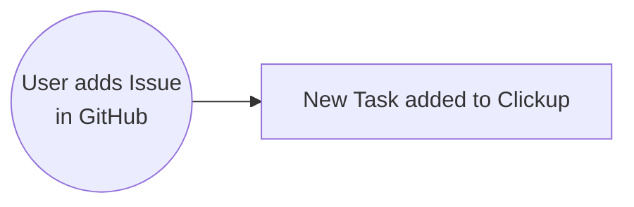
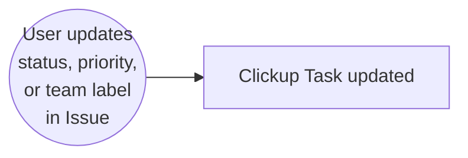

# minervabot

[contributors-shield]: https://img.shields.io/github/contributors/chingu-x/minervabot.svg?style=for-the-badge
[contributors-url]: https://github.com/chingu-x/minervabot/graphs/contributors
[forks-shield]: https://img.shields.io/github/forks/chingu-x/minervabot.svg?style=for-the-badge
[forks-url]: https://github.com/chingu-x/minervabot/network/members
[stars-shield]: https://img.shields.io/github/stars/chingu-x/minervabot.svg?style=for-the-badge
[stars-url]: https://github.com/chingu-x/minervabot/stargazers
[issues-shield]: https://img.shields.io/github/issues/chingu-x/minervabot.svg?style=for-the-badge
[issues-url]: https://github.com/chingu-x/minervabot/issues

[![Contributors][contributors-shield]][contributors-url]
[![Forks][forks-shield]][forks-url]
[![Stargazers][stars-shield]][stars-url]
[![Issues][issues-shield]][issues-url]

Table of Contents

- [Process Overview](#process-overview)
- [Installation](#installation)
- [Usage](#usage)
- [Release History](#release-history)
- [License](#license)

## Process Overview

Minervabot is invoked by GitHub as a webhook whenever an issue is created in a
repo. When invoked Minervabot clones the new GitHub issue to a new task in
Clickup. This allows Developers to have access to issues
within GitHub, but PO's, Scrum Masters, and team leads can use Clickup to
manage these within the larger scope of the project.

In addition, Minervabot also monitors updates to GitHub issue labels and updates
the cooresponding task in Clickup to make sure they are in sync with one another.

Minervabot **does not** update the description in the Clickup task when it's
updated in the cooresponding GitHub issue at this time. Similarly, this is a
one way operation. Issue data is only pushed one-way to Clickup and **not** from
Clickup to Github to eliminate the chance of lost data.

[Minerva](https://en.wikipedia.org/wiki/Minerva) is the Roman goddess of wisdom,
justice, law, victory, and the sponsor of arts, trade, and strategy. Her domain
includes music, poetry, medicine, wisdom, commerce, weaving, and the crafts. As
the sponsor of trade Minerva is perfect for connecting disparate systems like
GitHub and ClickUp.

## Installation

Minerva is a GitHub `repository webhook`.

## Usage

Minerva is implemented as a [GitHub Webhook](https://docs.github.com/en/webhooks/about-webhooks)
that is deployed as an ExpressJS server in Railway.

| Environment          | Webhook URL       | Deployed from Branch |
|:---------------------|:------------------|:---------------------|
| Development          | https://minervabot-development.up.railway.app/ghwebhook | `development` |
| Production           | https://minervabot-production.up.railway.app/ghwebhook | `main` |

### Environment Variables

| Variable Name        | Description        | Example |
|:---------------------|:-------------------|:--------|
| PORT                 | Port server will listen on | `3000`|
| CLICKUP_API_KEY      | API secret | `pk_99999999_A99W9F9M9QZCH9H9PVZHF99XZ9W9GH9A` |
| CLICKUP_SPACE_ID     | Space containing the list to be updated | `99849291044` |
| CLICKUP_LIST_ID      | List where tasks will be maintained | `992493854914` |
| CLICKUP_TEAM_ID      | Team id that owns the space | `9014206907` |

Use the [Try It](https://clickup.com/api/clickupreference/operation/GetSpaces/)
feature in Clickup to find the space, list, and team ID's.

## Release History

## License

Minervabot uses the [GNU GPL 3.0](https://github.com/chingu-x/minervabot?tab=GPL-3.0-1-ov-file#readme)
license.
